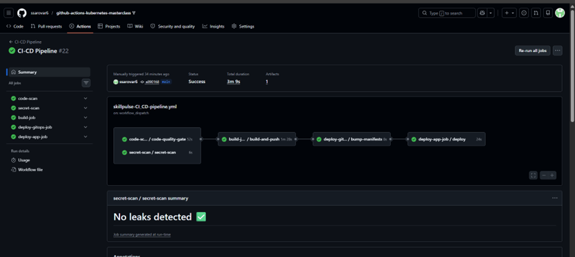

# SkillPulse - Production-Style 3-Tier Kubernetes Application with CI/CD, GitOps & Observability

SkillPulse is a production-oriented cloud-native application built to demonstrate modern DevOps, Kubernetes, GitOps, Infrastructure as Code, CI/CD automation, security scanning, and observability practices.

The application allows users to track skills they are learning and log the hours spent learning them.

While the application itself is intentionally simple, the real focus of this project is the complete deployment platform and operational ecosystem surrounding it.

---

# Project Goals

This repository demonstrates:

- Production-style Kubernetes deployments
- End-to-end CI/CD automation
- GitOps-based manifest updates
- Infrastructure provisioning using Terraform
- Kubernetes observability stack deployment
- Security automation in CI pipelines
- Immutable Docker image deployments
- Automated cluster provisioning
- Modern DevOps operational workflows

---

# Application Overview

| Tier | Technology | Purpose |
|---|---|---|
| Frontend | HTML + CSS + Vanilla JS + Nginx | User interface for skill tracking |
| Backend | Go 1.26 + Gin | REST API service |
| Database | MySQL 8.4 | Persistent storage |

---

# Tech Stack

| Category | Technology |
|---|---|
| Cloud Provider | AWS |
| Container Orchestration | Kubernetes |
| Infrastructure as Code | Terraform |
| GitOps | Git-based manifest updates (No ArgoCD) |
| CI/CD | GitHub Actions |
| Container Registry | Docker Hub |
| Backend | Go + Gin |
| Frontend | Nginx + Vanilla JavaScript |
| Database | MySQL 8.4 |
| Secrets Management | GitHub Actions Secrets & Variables |
| Monitoring | Prometheus + Grafana + Loki + Promtail + OpenTelemetry |
| Security Scanning | Gosec + Gitleaks + Hadolint + golangci-lint |

---

# Architecture Overview

```text
                                ┌────────────────────┐
                                │    Host Browser    │
                                │ http://localhost   │
                                │       :8888        │
                                └─────────┬──────────┘
                                          │
                                          ▼
                    kind extraPortMappings (8888 → 30080)
                                          │
                                          ▼
                           ┌─────────────────────────┐
                           │ Frontend Service        │
                           │ NodePort :30080         │
                           └──────────┬──────────────┘
                                      │
                                      ▼
                           ┌─────────────────────────┐
                           │ Frontend Deployment     │
                           │ Nginx + Static UI       │
                           └──────────┬──────────────┘
                                      │
                                      │ proxy_pass
                                      ▼
                           ┌─────────────────────────┐
                           │ Backend Service         │
                           │ ClusterIP :8080         │
                           └──────────┬──────────────┘
                                      │
                                      ▼
                           ┌─────────────────────────┐
                           │ Backend Deployment      │
                           │ Go + Gin REST API       │
                           └──────────┬──────────────┘
                                      │
                                      ▼
                           ┌─────────────────────────┐
                           │ MySQL Headless Service  │
                           │ Port :3306              │
                           └──────────┬──────────────┘
                                      │
                                      ▼
                           ┌─────────────────────────┐
                           │ MySQL StatefulSet       │
                           │ PVC + init.sql          │
                           └─────────────────────────┘
```

---

# Kubernetes Cluster Topology

The cluster contains:

- 1 Control Plane Node
- 2 Worker Nodes

```text
kind cluster
├── skillpulse-control-plane
├── skillpulse-worker
└── skillpulse-worker2
```

The control-plane node remains tainted with:

```bash
NoSchedule
```

ensuring workloads are scheduled only on worker nodes.

---

# CI/CD Pipeline Overview

The CI/CD pipeline is the core highlight of this project.

## CI Workflow

The CI pipeline performs the following:

### 1. Code Checkout

- Fresh Ubuntu runner
- Clean isolated build environment

### 2. Security & Code Scanning

Integrated automated scanning:

- golangci-lint
- Gosec SAST
- Gitleaks
- Hadolint

### 3. Docker Image Build

Builds two multi-stage Docker images:

- Backend image
- Frontend image

### 4. Immutable Tagging

Each image is tagged with:

```text
:latest
:<git-commit-sha>
```

Example:

```text
skillpulse-backend:3763dbb
skillpulse-backend:latest
```

### 5. Push to Docker Hub

Images are automatically pushed to Docker Hub.

### 6. GitOps Manifest Update

GitHub Actions automatically updates Kubernetes manifests:

```yaml
image: backend:<commit-sha>
```

and commits back to GitHub.

### 7. Deployment Automation

The CD pipeline:

- SSHs into target server
- Installs dependencies
- Creates kind cluster
- Creates namespaces
- Deploys monitoring stack
- Applies Kubernetes manifests
- Deploys SkillPulse application

---

# GitOps Workflow

This project follows a lightweight GitOps approach.

Instead of using ArgoCD or Flux:

- GitHub Actions updates manifests directly
- Kubernetes manifests inside `k8s/` become the deployment source of truth
- Changes are committed back to GitHub automatically

Example commit:

```text
deploy: pin backend+frontend to 3763dbb
```

---

# Security Automation

Security checks are fully integrated into CI.

## Implemented Security Scanning

| Tool | Purpose |
|---|---|
| Gitleaks | Secret leak detection |
| Gosec | Go SAST scanning |
| Hadolint | Dockerfile linting |
| golangci-lint | Go code quality |

---

# Monitoring & Observability

The platform includes a centralized observability stack.

## Monitoring Components

- Prometheus
- Grafana
- Loki
- Promtail
- OpenTelemetry Collector
- kube-state-metrics
- Node Exporter
- Kubernetes Metrics Server

---

# Monitoring Architecture

```text
Kubernetes Cluster
    ↓
Metrics Exporters & Resource Metrics
    ├─ Application Metrics
    ├─ Node Exporter Metrics
    ├─ kube-state-metrics
    ├─ Metrics Server
    ├─ Loki
    └─ Promtail

    ↓
Prometheus Scrapes Metrics
    ↓
Grafana Visualizes Metrics & Logs
```

---

# Screenshots

## SkillPulse Application


---

## Grafana Dashboard


---

## Prometheus Targets


---

## Prometheus Alerts


---

## GitHub Actions Pipeline



---

# Repository Structure

```text
.
├── backend/
│   ├── Dockerfile
│   ├── main.go
│   ├── database/
│   ├── handlers/
│   └── models/
│
├── frontend/
│   ├── Dockerfile
│   ├── nginx.conf
│   ├── index.html
│   ├── css/
│   └── js/
│
├── mysql/
│   └── init.sql
│
├── k8s/
│   ├── kind-config.yml
│   ├── 00-namespace.yml
│   ├── 10-mysql.yml
│   ├── 20-backend.yml
│   ├── 30-frontend.yml
│   └── monitoring-deployments.yml
│
├── monitoring/
│   ├── grafana/
│   ├── loki/
│   ├── promtail/
│   ├── otel-collector/
│   ├── prometheus.yml
│   └── alert-rules.yml
│
├── terraform/
│   ├── provider.tf
│   ├── ec2.tf
│   ├── variable.tf
│   └── output.tf
│
└── .github/
    └── workflows/
        ├── ci.yml
        ├── cd.yml
        ├── cd-k8s.yml
        ├── code-scan.yml
        ├── secret-scan.yml
        ├── infrastructure-as-code.yml
        ├── skillpulse-infra-pipeline.yml
        └── skillpulse-ci-cd-pipeline.yml
```

---

# Kubernetes Resources Used

- Deployments
- StatefulSets
- Services
- ConfigMaps
- Secrets
- PersistentVolumeClaims
- Namespaces
- ServiceAccounts

---

# Infrastructure Provisioning

Terraform provisions:

- AWS EC2 instances
- Networking resources
- Infrastructure outputs

Terraform files:

```text
provider.tf
ec2.tf
variable.tf
output.tf
```

---

# Docker Strategy

Both frontend and backend use multi-stage Docker builds.

## Backend

```text
golang:1.26-alpine → alpine:3.23
```

## Frontend

```text
nginx:alpine
```

---

# Public Endpoints

| Service | URL |
|---|---|
| SkillPulse Application | http://instance-ip:8888 |
| Grafana Dashboard | http://instance-ip:3000 |
| Prometheus | http://instance-ip:9090 |

---

# Installation & Deployment

## Clone Repository

```bash
git clone https://github.com/ssarovar6/github-actions-kubernetes-masterclass.git

cd github-actions-kubernetes-masterclass
```

---

# Kubernetes Deployment

## Create Kind Cluster

```bash
kind create cluster --config k8s/kind-config.yml
```

## Create Namespace

```bash
kubectl apply -f k8s/00-namespace.yml
```

## Deploy MySQL

```bash
kubectl apply -f k8s/10-mysql.yml
```

## Deploy Backend

```bash
kubectl apply -f k8s/20-backend.yml
```

## Deploy Frontend

```bash
kubectl apply -f k8s/30-frontend.yml
```

## Deploy Monitoring Stack

```bash
kubectl apply -f k8s/monitoring-deployments.yml
```

---

# GitHub Actions Workflows

| Workflow | Purpose |
|---|---|
| ci.yml | Build & push Docker images |
| cd.yml | Remote deployment |
| cd-k8s.yml | GitOps manifest updates |
| code-scan.yml | Static code analysis |
| secret-scan.yml | Secret leak scanning |
| infrastructure-as-code.yml | Terraform provisioning |
| skillpulse-infra-pipeline.yml | Infrastructure deployment |
| skillpulse-ci-cd-pipeline.yml | End-to-end orchestration |

---

# Secrets Management

Sensitive values are managed using:

- GitHub Actions Secrets
- GitHub Repository Variables
- Kubernetes Secrets

No secrets are committed into Git.

---

# Namespace

```text
skillpulse
```


---

# Original Project Foundation

This repository was originally derived from:

```text
LondheShubham153/github-actions-kubernetes-masterclass
```

The original implementation provided:

- Basic Dockerfiles
- docker-compose setup
- Simple GitHub Actions pipeline
- SSH deployment using Docker Compose

This project significantly redesigns and extends that foundation into a production-oriented Kubernetes deployment platform.

---

# Major Enhancements Over Original Project

Implemented additions include:

- Terraform infrastructure provisioning
- Kubernetes-native deployments
- GitOps workflows
- Kind cluster automation
- Monitoring & observability stack
- Security automation pipelines
- Immutable image deployments
- Production-style CI/CD architecture

---

# Future Improvements

Potential future enhancements:

- ArgoCD integration
- Helm chart packaging
- Kubernetes Ingress Controller
- HTTPS/TLS support
- Horizontal Pod Autoscaling
- AWS EKS migration
- RBAC hardening
- Vault-based secrets management
- Distributed tracing with Tempo/Jaeger

---

# Repository

GitHub Repository:

https://github.com/ssarovar6/github-actions-kubernetes-masterclass


---

# License

This project is intended for educational and DevOps learning purposes.